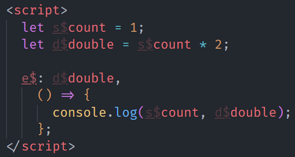

# Brefer project for Svelte 5 preprocessing

## Installation

### Svelte preprocessor

```bash
npm install -D @brefer/preprocessor
```

### Vite plugin for Svelte

```bash
npm install -D @brefer/vite-plugin-svelte
```

For PNPM and YARN, just replace `npm install` with `pnpm add` or `yarn add` in the commands above.

**Warning!** Brefer is not yet ready for production (well, Svelte 5 neither). Expect bugs and breaking changes, as the syntax is not yet entirely decided.

## Usage

### @brefer/preprocessor

```js
// svelte.config.js
import { vitePreprocess } from "@sveltejs/vite-plugin-svelte";
import { breferPreprocess } from "@brefer/preprocessor";

export default {
	preprocess: [vitePreprocess(), breferPreprocess()],
};
```

### @brefer/vite-plugin-svelte

```js
// vite.config.js
import { defineConfig } from "vite";
import { brefer } from "@brefer/vite-plugin-svelte";

export default defineConfig({
	plugins: [brefer()],
});
```

## What is it?

Brefer is a monorepository containing both a Svelte preprocessor and a Vite plugin to shorten the new Svelte 5 syntax for handling reactivity (hence the name "Brefer", made from "Breferkai" which means "Short" in Japanese).
If you want to solely process `.svelte` files, using `@brefer/preprocessor` will be enough. If you also want to preprocess `.svelte.js` files, you will need to use `@brefer/vite-plugin-svelte` instead.

## Why?

What was your reaction when Rich Harris announced that Svelte 4's reactivity, which was as concise as a JS framework reactivity syntax could be, would be abandoned in favor of ~~Vue~~ Runes syntax?
If you were delighted, Brefer is probably not for you. Personally, I didn't want to write `$state` and `$derived` everytime I defined a new reactive variable. That's the reason I started this project.

## Ok but... What is the Brefer syntax?

With Brefer, I opted for a more straightforward syntax:

> Prefixing your variables with `s$` makes them a state.
> Prefixing your variables with `d$` makes them derived.
> An arrow function (or a scope block) preceeded by the `e$:` label creates an effect.

That is really all you have to know (currently).

### Here are some examples

#### With Svelte 5

```svelte
<script>
  let count = $state(0);
  let double = $derived($count * 2)
</script>

<button on:click={() => count++}>
  clicks: {count}
  double: {double}
</button>
```

#### With Brefer

```svelte
<script>
  let s$count = 0;
  let d$double = s$count * 2;
</script>

<button on:click={() => s$count++}>
  clicks: {s$count}
  double: {d$double}
</button>
```

#### With Svelte 5

```svelte
<script>
  class Counter {
    count = $state(0);
    double = $derived(this.count * 2);

    increment() {
      this.count++;
    }
  }

  let counter = new Counter();
</script>

<button on:click={() => counter.increment()}>
  clicks: {counter.count}
  double: {counter.double}
</button>
```

#### With Brefer

```svelte
<script>
  class Counter {
    s$count = 0;
    d$double = this.s$count * 2;

    increment() {
      this.s$count++;
    }
  }

  let counter = new Counter();
</script>

<button on:click={() => counter.increment()}>
  clicks: {counter.$count}
  double: {counter.$double}
</button>
```

> I somewhat have JQuery flashbacks... I don't want to see `$` everywhere again (not that it wasn't the case with Svelte already)! 😭

### About that...

If you really hate the default prefixes, you can change them to something else (as long as it is a valid JS variable name) by passing the `prefixes` option to the preprocessor or Vite plugin:

#### Preprocessor

```js
// svelte.config.js
import { vitePreprocess } from "@sveltejs/vite-plugin-svelte";
import { breferPreprocess } from "@brefer/preprocessor";

export default {
	preprocess: [
		vitePreprocess(),
		breferPreprocess({
			prefixes: { state: "state_", derived: "derived_", effect: "effect" },
		}),
	],
};
```

#### Vite plugin

```js
// vite.config.js
import { defineConfig } from "vite";
import { brefer } from "@brefer/vite-plugin-svelte";

export default defineConfig({
	plugins: [
		brefer({
			prefixes: { state: "state_", derived: "derived_", effect: "effect" },
		}),
	],
});
```

## Typescript

Brefer supports typescript out of the box as it uses [@typescript-eslint/parser](https://typescript-eslint.io/packages/parser/) to parse the script content for `.svelte` files and `.svelte.[js|ts]` files.

## Pros and cons

### Pros

- More concise than Svelte 5's syntax
- Easier to keep track of reactive variables (they all have the same prefix)
- Works with Typescript
- Easy to integrate
- It's a preprocessor, so you can still use Svelte 5's syntax if you want to
- Can preprocess svelte modules (`.svelte.[js|ts]`)

### Cons

- You have to use a preprocessor

## Other features

### $effect

Brefer also allows you to opt for a shorter way to use `$effect`:

```js
// Svelte 5
let scount = $state(1);
$effect(() => {
	console.log(count);
});
// Brefer
let s$count = 1;
e$: {
	console.log(s$count);
}
// or, if you need to return a cleanup function
e$: () => {
	console.log(s$count);

	return () => {
		console.log("cleanup");
	};
};
```

Even better, you can also specify the values you want to untrack:

```js
// Svelte 5
import { untrack } from "svelte";

let count = $state(1);
let double = $derived(count * 2);
$effect(() => {
	console.log(
		count,
		untrack(() => double)
	);
});
// Brefer
let s$count = 1;
let d$double = s$count * 2;
e$: d$double, // untracked, values, coma, separated,
	() => {
		console.log(s$count, d$double);
	};
```

When you specify values to untrack, you have to use an arrow function as scope blocks can't be used in sequential expressions.

### Better DX (Developer Experience)

If the syntax looks too ugly for you (hard to see the name of the variables due to the prefix) and you're a VSCode user, you can use the [Highlight VSCode extension](https://marketplace.visualstudio.com/items?itemName=fabiospampinato.vscode-highlight) to define a new syntax highlighting rule.
For example, if you want to have the prefix at 25% opacity and underlined (you can check the full styles list [here](https://code.visualstudio.com/api/references/vscode-api#DecorationRenderOptions).), but not the entire variable, you can download the extension and add this in your `settings.json`:

```json
"highlight.regexes": {
  "(?<![_\\$\\.'\"`]|[:alnum:]|//|// |/\\*|/\\* | \\*| \\* )([sde]\\$)(?=[_\\$]*|[:alnum]*)": {
    "filterFileRegex": ".*\\.svelte(\\.js|\\.ts)?$",
    "decorations": [
      {
        // Change the prefix's style here
        "opacity": "0.25",
        "textDecoration": "underline"
      }
    ]
  }
}
```

It looks like this in my IDE:


This extension uses Regex to find the token to change the style of. I know, this regular expression looks atrocious but the part that interests us is pretty short: `([sde]\\$)`.

It's pretty easy to translate: I want one of the characters: "s", "d", "e" (`[sde]`), followed by a "\$" sign (`\\$`).
If you understand this, you can further customize the style of your prefixes. For example, you could have 3 different styles for each of your prefixes. In that case, you will need 3 different regular expressions (one for each `(s\\$)`, `(d\\$)` and `(e\\$)`).

## Contribute

If you like the concept and want to contribute, feel free to open an issue or a pull request.
Also, if you have any idea to improve or extend the syntax, I'm all ears!
